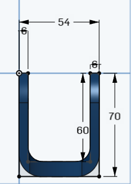

# 🔩 Joint Design and Development
  # 📐 Description
"Joint Design and Development" is a mechanical 3D model created using Onshape (a cloud-based CAD tool).

This project focuses on improving the durability and strength of a mechanical joint by increasing the wall thickness from 4.5 mm to 6 mm.
The final design is exported in STL format for 3D printing or mechanical analysis.

# 🧰 Tools Used
Onshape – Cloud-based CAD modeling platform

STL format – for 3D printing and simulation

# 📸 Dimensions Preview
   
   

# 3D Model
You can Download the design file in STL format here:  
[Download STL](joint.stl)

